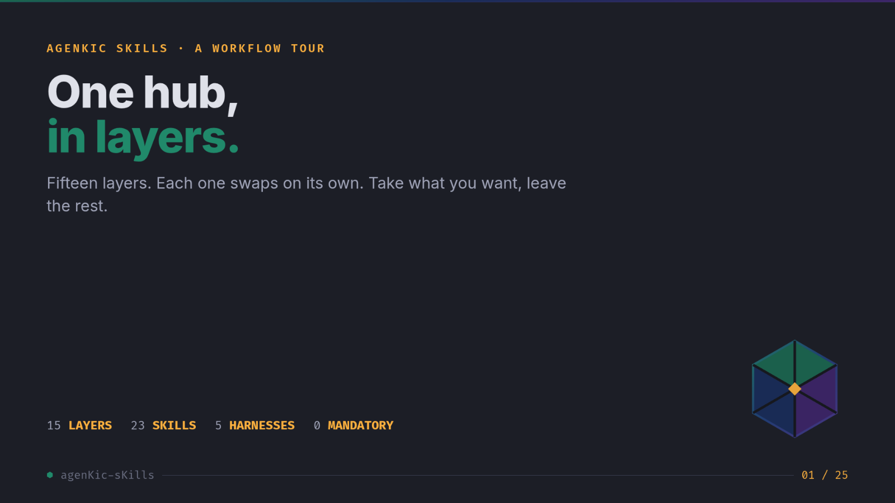
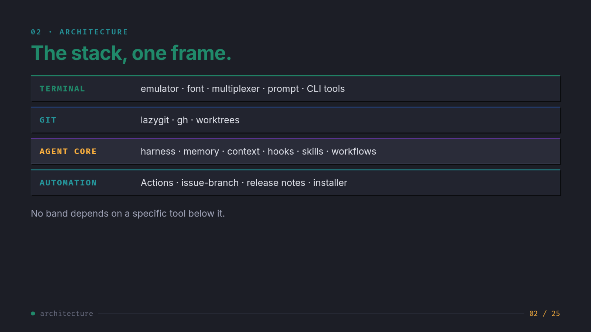
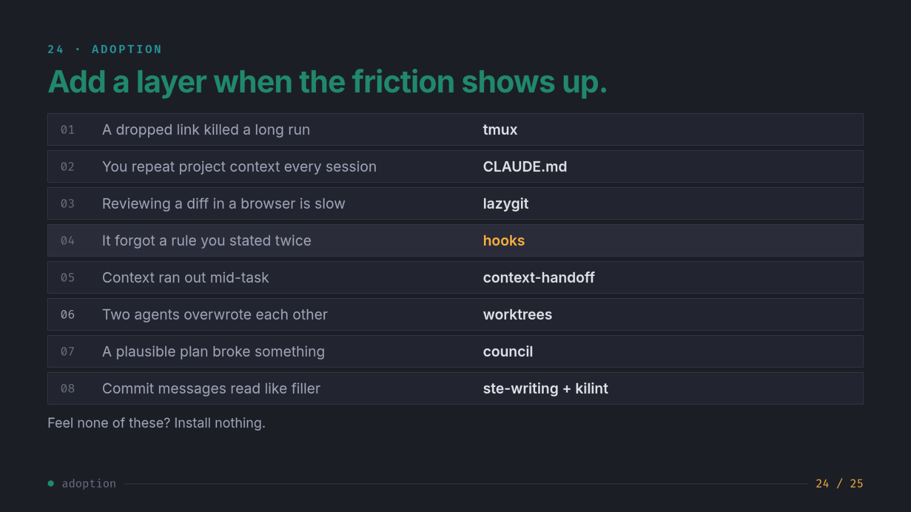
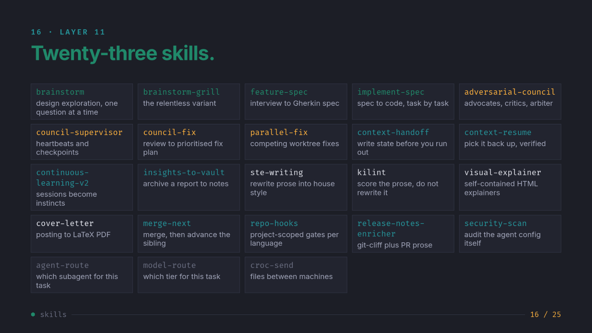

# agenKic sKills

A public agentic hub: Claude Code skills, multi-agent workflows, harness setups, and
terminal configs, with an installer that adapts them to your machine.

Docs site: https://kiriketsuki.github.io/agenKic-hub/

[](https://kiriketsuki.github.io/agenKic-hub/decks/agentic-workflow/)

## Quick start

```bash
git clone https://github.com/Kiriketsuki/agenKic-hub
cd agenKic-hub
./setup/setup.sh          # Linux / macOS / Git Bash
```

```powershell
.\setup\setup.ps1         # Windows PowerShell
```

The setup script asks which components you want (skills, workflows, harness configs,
tmux, zsh, statusline), asks for your template variables, and symlinks everything into
place. Pass `--profile setup/answers.example.yml` (copy and edit it first) for a
non-interactive run. Manual per-OS symlink commands live in
[docs/setup/symlinks.md](docs/setup/symlinks.md).

## The workflow, in layers

The whole setup, from a bare shell up to the agentic stack. Fifteen layers in
four bands. Each layer swaps on its own, and nothing is mandatory. No band
depends on a specific tool below it.

Prefer slides? The same tour exists as a presentable deck:
[docs/decks/agentic-workflow/](docs/decks/agentic-workflow/), served at
https://kiriketsuki.github.io/agenKic-hub/decks/agentic-workflow/. Arrow keys
navigate. Print to PDF gives one page per slide.

| Band | Covers | Buys you |
|:---|:---|:---|
| Terminal | emulator, font, multiplexer, prompt, CLI tools | Comfort and session survival |
| Git | lazygit, gh, worktrees | Review speed |
| Agent core | harness, memory, context, hooks, skills, workflows | Where the work happens |
| Automation | Actions, issue-branch, release notes, installer | Runs without you at the keyboard |



### Band 1: terminal foundation

| # | Layer | The idea | Swap for |
|:--|:---|:---|:---|
| 01 | Emulator ([Ghostty](https://ghostty.org/)) | Draws text and forwards keys. One plain config file. It is not the shell. | WezTerm, Kitty, Alacritty, iTerm2, Windows Terminal |
| 02 | Nerd Fonts | Icon glyphs patched into a font's private use area. Prompts, lazygit, and eza assume them. If you see boxes, fix the terminal font setting, not the tool. | Skip if you run a plain prompt and plain `ls` |
| 03 | Multiplexer (tmux) | The session lives on the server. The connection drops, the session does not. A long agent run over SSH survives a closed laptop. Cost: one prefix key. | Zellij, screen, native tabs if you never work remote |
| 04 | Prompt + small tools (Starship) | The prompt shows branch, dirty tree, and last exit code, so you never ask. Small tools are a menu, not a mandate: zoxide, eza, bat, fzf, rg, fd. | p10k, or any prompt that shows git state |

### Band 2: git speed

| # | Layer | The idea |
|:--|:---|:---|
| 05 | lazygit + gh | An agent stages files faster than a browser review can follow. lazygit gives hunk-level staging on single keys. `gh` is how the agent talks to GitHub at all: no `gh auth`, no pull requests. |
| 06 | Worktrees | Two agents in one directory clobber each other. A worktree is a second working directory on the same object database. One agent per worktree, one branch per worktree, merge each result on its own. Used by [parallel-fix](skills/parallel-fix/). |

### Band 3: the agent core

| # | Layer | The idea |
|:--|:---|:---|
| 07 | Harness | The runtime that holds the agent. This repo scaffolds five: Claude Code (primary, `~/.claude/`), Codex CLI (`~/.codex/`), OpenCode (`~/.config/opencode/`), Pi and Hermes (README-only scaffolds). Skills install separately. The harness only wires them. |
| 08 | Project memory | `CLAUDE.md` loads every session. `AGENTS.md` is the cross-tool file. Import one from the other, never keep two copies. A few dozen lines: commands and hard rules. A long memory file competes with the task for attention. |
| 09 | Context budget | Quality degrades before the window is full. 0-128k work freely, 128k-256k watch it, at 256k hand off. With `/compact` the summarizer decides what survives. With [context-handoff](skills/context-handoff/) → [context-resume](skills/context-resume/), you decide. |
| 10 | Hooks | A prompt asks the model to behave. A hook is a shell command the harness runs regardless. Exit 0 proceeds, exit 2 blocks and hands stderr back. If you stated a rule twice and the model still forgot it, that rule becomes a hook. |
| 11 | Skills | 23 directories, each with a `SKILL.md` that says when to trigger. Independent: take brainstorm and leave the councils, or the reverse. Full table below. |
| 12 | Adversarial council | Real spawned agents, not prose sections in one reply. One model writing both sides agrees with itself. Advocates argue cited, critics never soften without a reason, a questioner fires "why?" at uncited claims, an arbiter returns FOR, AGAINST, or CONDITIONAL. Concessions are permanent. |
| 13 | spec-loop + model tiering | A spec decomposes into a dependency DAG. Unblocked leaves build in parallel worktree waves. Every PR faces a council and merges on unconditional FOR. The script only coordinates, only agents touch the world. Tiering: top model for design and hard root-causing, mid tier for the fan-out. One 33-agent run that inherited the top model everywhere burned 2M tokens. Escalate only after the mid tier failed. |
| 14 | Prose as a build artifact | Agents write commits, PR bodies, and docs at volume, and left alone they drift into filler. [ste-writing](skills/ste-writing/) sets the house style, [kilint](skills/kilint/) measures it in a PostToolUse hook and in CI. Under 1.5 violations per 100 words is clean. Do not chase zero, and form linting cannot fix a wrong claim. |

### Band 4: automation

| # | Layer | The idea |
|:--|:---|:---|
| 15 | CI | Six workflows: docs, release, three gates, and an issue-branch handler that turns an issue into a branch on its own. Tag `@claude` on a comment and the agent runs on a GitHub runner. Credentials live in repo secrets, never in the YAML. |
| — | Installer | The installer enforces the modularity. One manifest per component, bash and PowerShell scripts, `{{variable}}` templates for machine values, `--dry-run` to preview. Existing files move to `.bak`. Re-running only replaces links it made itself. |

### Adoption order

Do not install fifteen layers tonight. Add a layer when its friction shows up:

| Friction you feel | Layer that fixes it |
|:---|:---|
| A dropped link killed a long run | tmux |
| You repeat project context every session | CLAUDE.md |
| Reviewing a diff in a browser is slow | lazygit |
| It forgot a rule you stated twice | hooks |
| Context ran out mid-task | context-handoff |
| Two agents overwrote each other | worktrees |
| A plausible plan broke something | council |
| Commit messages read like filler | ste-writing + kilint |



Feel none of these? Install nothing.

## What is here

| Directory | Contents |
|:---|:---|
| [`skills/`](skills/) | 23 Claude Code skills, install into `~/.claude/skills/` |
| [`workflows/`](workflows/) | Multi-agent Workflow scripts for the Claude Code Workflow tool |
| [`harnesses/`](harnesses/) | Per-harness setup: Claude Code, Codex, OpenCode, Pi, Hermes |
| [`config/`](config/) | Terminal environment: tmux, zsh fragments, statusline |
| [`setup/`](setup/) | Cross-platform installer with component picker and templating |
| [`docs/`](docs/) | Source for the docs site (mkdocs-material) |

## Skills



| Skill | What it does |
|:---|:---|
| [adversarial-council](skills/adversarial-council/) | Adversarial debate over a decision or plan: advocates, critics, questioner, arbiter |
| [agent-route](skills/agent-route/) | Recommend the right subagent type for a task |
| [brainstorm](skills/brainstorm/) | Collaborative design exploration before implementation, one question at a time |
| [brainstorm-grill](skills/brainstorm-grill/) | The relentless variant: interrogates a plan along the decision-tree frontier |
| [continuous-learning-v2](skills/continuous-learning-v2/) | Instinct-based learning system that observes sessions via hooks and evolves instincts into skills |
| [context-handoff](skills/context-handoff/) | Write a session handoff before context runs out |
| [context-resume](skills/context-resume/) | Resume work from a previous session handoff |
| [council-fix](skills/council-fix/) | One-command council review pipeline that ends in a prioritized fix plan |
| [council-supervisor](skills/council-supervisor/) | Supervised multi-round council with heartbeats, checkpoints, and agent replacement |
| [cover-letter](skills/cover-letter/) | Cover letter from a job posting, rendered as a LaTeX-quality PDF |
| [croc-send](skills/croc-send/) | Send files between machines with croc over tailscale |
| [feature-spec](skills/feature-spec/) | Interview-driven feature spec with Gherkin acceptance scenarios |
| [implement-spec](skills/implement-spec/) | Implement a written spec task by task |
| [insights-to-vault](skills/insights-to-vault/) | Archive a Claude Code Insights report into a notes vault |
| [kilint](skills/kilint/) | Prose linter for the STE house style |
| [merge-next](skills/merge-next/) | Merge the current branch and advance to the next sibling |
| [model-route](skills/model-route/) | Recommend the optimal model tier for a task |
| [parallel-fix](skills/parallel-fix/) | Fan out independent fixes to parallel worktree agents |
| [release-notes-enricher](skills/release-notes-enricher/) | Enrich git-cliff release notes with PR prose summaries |
| [repo-hooks](skills/repo-hooks/) | Install and manage the repo's git hook conventions |
| [security-scan](skills/security-scan/) | Audit Claude Code configuration for security risks with AgentShield |
| [ste-writing](skills/ste-writing/) | Rewrite AI-flavored prose into a controlled house style |
| [visual-explainer](skills/visual-explainer/) | Self-contained HTML pages that explain systems, diffs, and plans visually |

## Workflows

Scripts for the Claude Code Workflow tool: council loops, spec loops, ultracode
fix and implement pipelines, and worked examples for data pipelines. Each file
carries a header comment stating what to customize. Catalog:
[docs/workflows/index.md](docs/workflows/index.md).

## Patterns

Articles distilled from daily agentic use: the debugging protocol, workflow model
tiering, council patterns, clip-path borders, and a Gherkin primer for reading the
specs these skills produce. Start at [docs/patterns/index.md](docs/patterns/index.md).

## License and attribution

Several skills adapt upstream work and say so in their frontmatter: brainstorm
(anthropics/claude-plugins-official), brainstorm-grill (mattpocock grilling),
visual-explainer (nicobailon/visual-explainer). Keep those notices when redistributing.
