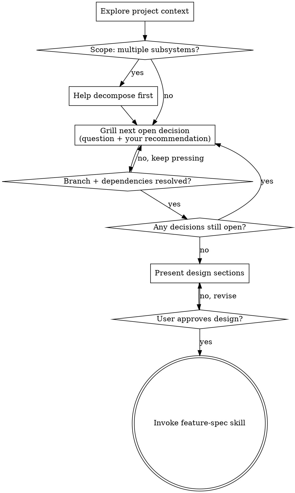

# Brainstorm: Grill Mode

Same destination as `brainstorm` — an approved design handed off to feature-spec — reached by a harder road. Instead of gently drawing the idea out, you interrogate it. Walk down every branch of the decision tree, resolve the dependencies between decisions one at a time, and refuse to move on while a branch is still unresolved. The goal is shared understanding with no soft spots left.

This is a sibling of `brainstorm`, not a replacement. Default `brainstorm` stays gentle. Invoke this one only when the user wants to be grilled.

<HARD-GATE>
Do NOT write any code, scaffold any project, or take any implementation action until you have presented a design and the user has approved it. Grilling is interrogation, not implementation. This applies to EVERY project regardless of perceived simplicity.
</HARD-GATE>

## What "grill properly" means

The difference from default brainstorm is the questioning, not the outcome:

| Default brainstorm | Grill mode |
|---|---|
| Gentle clarifying questions | Relentless interrogation of every decision |
| Asks, then waits | Asks via AskUserQuestion — recommended answer is option 1, reasoning in its description |
| Moves on when the user answers | Does not move on until the branch and its dependencies are resolved |
| Accepts vague answers, refines later | Pushes back on vague answers immediately; pins down the testable version |
| Proposes 2-3 approaches near the end | Surfaces forks the moment they appear, walks each branch to resolution |

**Every question carries your recommendation.** Never ask a bare question. Ask through the **AskUserQuestion** tool: the `question` states the decision, and the `options` are the candidate answers — the first option is your recommendation, its label ending in " (Recommended)", its `description` carrying the "because Y" reasoning. The user can pick it, choose another option, or use the built-in "Other" to override or argue — but they are never left to fill a blank cold.

**Explore before asking.** If a question can be answered by reading the codebase, read the codebase instead of asking. Spend repo context freely; only ask the user what the repo genuinely cannot tell you.

## Checklist

Create a task for each item and complete them in order:

1. **Explore project context** — files, docs, recent commits, existing patterns. Answer everything you can from the repo before opening your mouth.
2. **Scope check** — if the request is really several independent subsystems, say so before grilling. Help decompose, then grill the first sub-project.
3. **Grill the decision tree** — one question at a time, each with a recommended answer, walking every branch and resolving dependencies between decisions.
4. **Present design** — in sections scaled to complexity, get approval after each section.
5. **Hand off to feature-spec** — invoke the feature-spec skill to formalize the approved design.

## Process Flow

## The Grilling Protocol

**Map the decision tree first.** Before the first question, build (in your head, or out loud if it helps) the set of decisions this plan requires and how they depend on each other. Grill in dependency order: a decision that constrains others comes first, because its answer prunes branches downstream.

**One question at a time, always with a recommendation — asked through AskUserQuestion.** Do not grill in plain prose. Each open decision becomes one AskUserQuestion call:

- `question` — the specific decision, framed concretely.
- `header` — a short tag for the decision (max 12 chars), e.g. "Storage", "Auth", "Scope".
- `options` — the candidate answers, 2-4 of them. **Option 1 is your recommendation**, its `label` ending in " (Recommended)", its `description` carrying the "because Y" reasoning grounded in the repo, the constraints, or the goal. The remaining options are the live alternatives, each with a `description` of its trade-off.
- `multiSelect: false` — a decision resolves to exactly one answer.

The user can accept your recommendation, pick an alternative, or use the automatic "Other" choice to override or argue. For open-ended decisions ("what does 'works' mean here?"), make option 1 the recommended testable definition and the others plausible variants — never leave it as a blank prose prompt. When the fork is between concrete artifacts (competing layouts, API shapes, code snippets), put a short mockup of each in the option's `preview` field so the user compares them side by side.

Default to **one question per call** — grill mode walks the decision tree in dependency order, and batching breaks that (a later answer may prune an earlier question). Put more than one question in a single AskUserQuestion call only when the decisions are provably independent — no dependency edge between them — and you are clearing a flat cluster at the same level (the tool takes up to 4). Never ask without recommending.

**Resolve dependencies before descending.** When an answer opens sub-decisions, walk those sub-branches to resolution before returning to siblings. Track what is settled so you never re-litigate a closed branch and never leave one dangling.

**Push back on vagueness.** "When it works" / "something simple" / "the usual" are not answers — they are deferrals. Convert them into something testable on the spot: "'Works' meaning a user can do X and Y is true in the system — yes?" Do not accept a hand-wave and move on.

**Probe for the gaps the user hasn't considered.** Failure modes, edge cases, what happens under concurrency, what happens when the input is empty / huge / malformed, what the rollback path is, what the success metric actually is. If the plan has an unexamined assumption, name it and make them defend it or drop it.

**Explore the codebase instead of asking, whenever possible.** "Which auth library?" — read package.json. "What's the existing error pattern?" — grep the codebase. Only escalate to the user the decisions the code cannot answer.

**Know when to stop.** Grilling ends when every branch of the decision tree is resolved and you can state the design back with no open questions. Relentless does not mean infinite — it means thorough. Once shared understanding is reached, stop grilling and present the design.

## Presenting the Design

Same as brainstorm:

- Scale each section to its complexity — a few sentences if straightforward, up to 200-300 words if nuanced.
- Ask after each section whether it looks right.
- Cover: architecture, components, data flow, error handling, testing.
- Because you grilled the decisions, this design should contain few surprises — it is the resolved decision tree written down.

**Design for isolation and clarity:** break the system into small units with one clear purpose each, communicating through well-defined interfaces, understandable and testable independently. For each unit: what does it do, how do you use it, what does it depend on. When a file grows large, that is a signal it is doing too much.

**In existing codebases:** explore structure before proposing changes, follow existing patterns, fold in targeted improvements where existing problems affect the work, but don't propose unrelated refactoring.

## After the Design Is Approved

Once the user approves the design, invoke the **feature-spec** skill to formalize it into a structured spec file. Pass along a summary of every decision resolved during grilling so feature-spec pre-fills instead of re-interviewing:

> "Design approved. Invoking feature-spec to formalize this into a structured spec."

Then invoke the feature-spec skill. brainstorm-grill ends here — feature-spec takes over for the structured output (the spec lands in the target repo's `docs/specs/todo/`).

## Key Principles

- **One question at a time** — one AskUserQuestion call per open decision; batch only provably independent decisions.
- **Every question carries your recommendation** — ask via AskUserQuestion, recommendation as option 1, no bare questions.
- **Resolve dependencies in order** — settle constraining decisions first.
- **No vagueness survives** — convert hand-waves into testable statements immediately.
- **Explore the repo before asking** — code answers free questions.
- **YAGNI ruthlessly** — grill out features that don't earn their place.
- **Relentless, not infinite** — stop when the tree is resolved, then present and converge.
